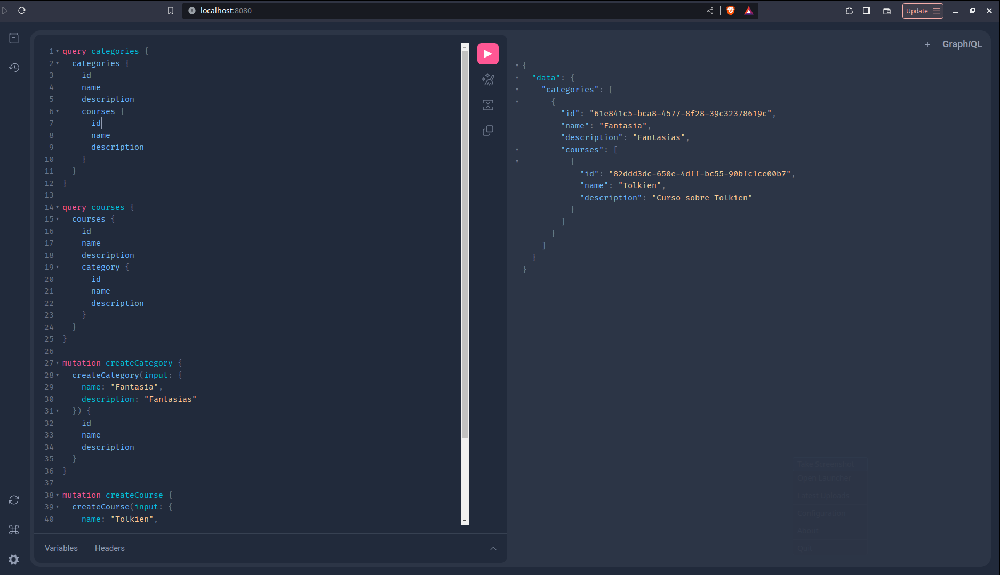

# Learn GraphQL GO



> Projeto com o intuito de estudar e aprender a implementar GraphQL com GO

### Funcionalidades

- [x] Listagem de categorias
- [x] Criação de categoria
- [x] Listagem de cursos
- [x] Criação de curso
- [x] Encadeamento nas queries de categorias e cursos

### 💻 Pré-requisitos

- [Go](https://golang.org/) instalado na sua maquina.
- O projeto está usando banco de dados interno, [sqlite3](https://www.sqlite.org/index.html)

### Executando o projeto

1. Clone o repositório:

   ```bash
   git clone https://github.com/joaovds/learn-graphql-go

   cd learn-graphql-go
   ```

2. Instale as dependências:

   ```bash
   go mod tidy
   ```

5. Execute o servidor:

   ```bash
   go run cmd/graphql_server/main.go
   ```

### ☕ Endpoints

Execute queries no playground que estará disponível em http://localhost:8080/

### 🤝 Colaboradores

<table>
  <tr>
    <td align="center">
      <a href="#" title="João Victor da Silva">
        <br>
        <sub>
          <b>João Victor da Silva Silva</b>
        </sub>
      </a>
    </td>
  </tr>
</table>
